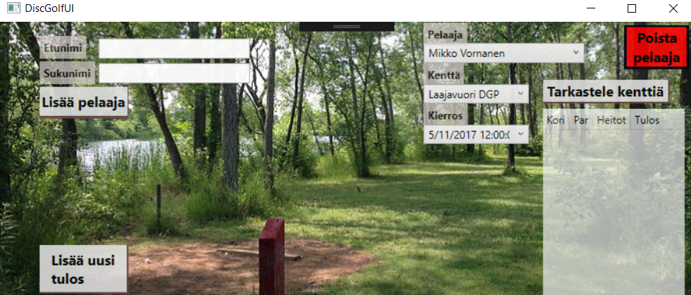
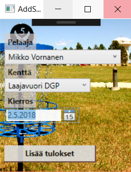
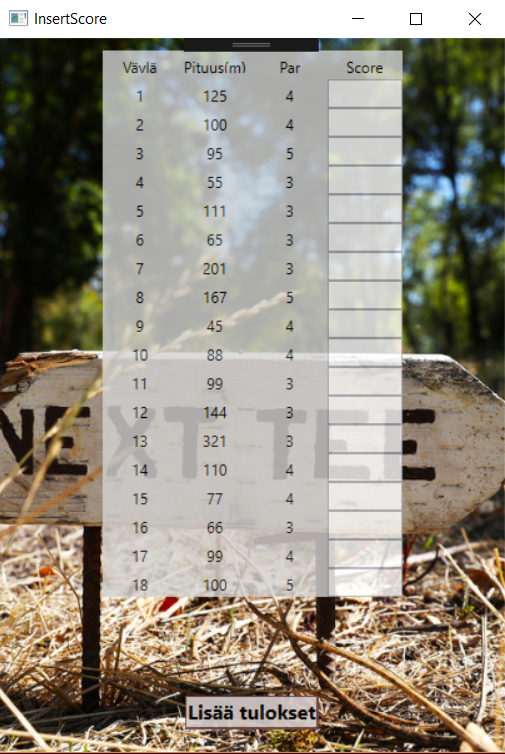
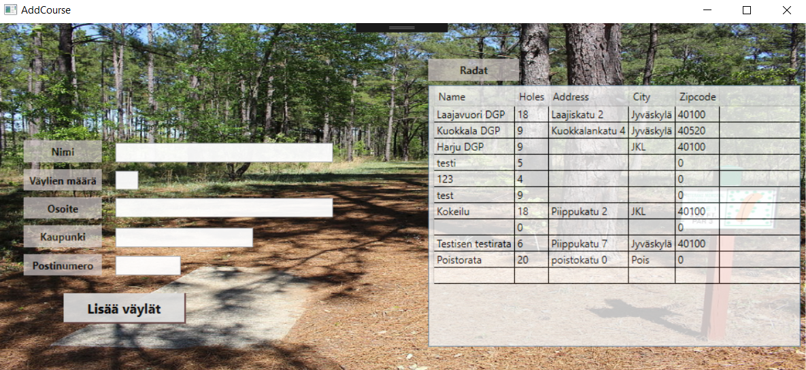
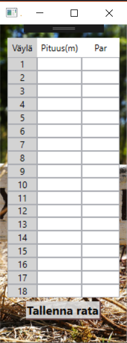

# HARJOITUSTYÖN LOPPURAPORTTI 

### Tekijät:

- Mikko Vornanen L5571  
- Ilari Rajala L4134

## Asennus

### Asioita joita tehtävä ja huomioitava asennuksessa  
Ohjelma tarvitsee yhteyden MySQL-serverille, johon on jo tehty ohjelman tarvitsemat taulut.

### Käytetyt=tarvittavat .NET Frameworkin ulkopuoliset kirjastot tai kilkkeet  
* MySql.Data
* MySql.Data.MySqlClient

### Konfiguroitavat asiat  
DBtier.cs tiedostoon pitää laittaa serverin osoite, käyttäjä ja salasana, jotta ohjelma pystyy ottamaan yhteyden MySQL-tietokantaan.

## Tietoa ohjelmasta

Ohjelmalla voi pitää kirjaa frisbeegolf pelaajien tuloksista ja eri frisbeegolf kentistä.

### Suunnitellut ominaisuudet, jotka toteutettu:
| ID | Ominaisuus | Kuvaus |
|:-:|:-:|:-:|
| 1 | Näytä pelaajan tulokset | Tulostaa pelaajan tulokset tauluun |  
| 2 | Valitse pelaaja | Pystyy valitsemaan tietyn pelaajan, jonka tietoihin pystyy lisäämään kierroksia tietokantaan |
| 3 | Lisää uusi pelaaja | Lisää uuden pelaajan tietokantaan |
| 4 | Lisää kenttä | Lisää uuden kentän tietokantaan |
| 5 | Lisää kenttään reiät | Lisää uuteen kentään reiät tietokantaan|
| 6 | Lisää kierros | Lisää tietylle pelaajalle ja kentälle kierros tietokantaan |
| 7 | Lisää kierrokseen tulokset | Lisää tietylle pelaajan ja kentän kierrokselle pisteet reikä kohtaisesti ja lisää ne tietokantaan|
| 8 | Poista pelaaja | Poistaa pelaajan ja poistaisi tietokannasta samalla pelaajan kaikki tulokset |

### Ei-toiminnalliset vaatimukset sekä mahdolliset reunaehdot/rajoitukset

* Labranetin SQL serverin pitää olla toiminnassa
* VPN yhteys pitää olla luotuna Labranettiin, jos käyttää labranetin ulkopuolelta

## Ohjeet

- PääIkkuna, jossa pystyy lisäämään/poistamaan pelaajia ja tarkastelemaan heidän pelaamiaan kierroksia.

Pääikkunasta "Lisää uusi tulos"-->  

- Täältä voi halutulle pelaajalle lisätä uuden kierroksen.

Lisää uusi tulos ikkunasta "Lisää tulokset"-->    

- Täältä voidaan lisätä jokaiselle korille heittomääärät.

Pääikkunasta "Tarkastele kenttiä"-->    

- Täältä nähdään jo tehdyt kentät sekä voidaan lisätä uusia kenttiä.

Tarkastele kenttiä ikkunasta "Lisää väylät"-->    

- Täältä voidaan syöttää kentän väylille tiedot.

## Ohjelman tarvitsemat /mukana tulevat tiedostot/tietokannat

MySQL-tietokannan rakenne.  
  
Tietokantaa ei tarvitse tässä tapauksessa tehdä, vaan ohjelmaan jo valmiiksi asettamien tunnusten takana löytyy testikäyttö-tietokanta. 

Tässä tietokannan luontiskripti ja myös testidataa

* [Mysql DGDB](/dgdb.sql)
* [Mysql DGDB testdata](/dgdbtestdata.sql)

## Tiedossa olevat ongelmat ja bugit sekä jatkokehitysideat

Toteutuksessa yksi iso kehityksen kohde. Round comboboxissa tulisi saada näkyviin vain  
valitun pelaajan kierrokset. Nyt jos kierroksia on iso määrä ja suurinosa niistä on osalle 
pelaajista tyhjiä menee aikaa, että löytää tietoa mitä haluaisi. SQL kyselynä saan oikeanlaista
tietoa, mutta LINQ kysely liitettynä comboboxselection changed methodeihin ei toimi niinkuin pitäisi.

Jos ei ratkaisua osaa tehdä niin tämän voisi tarvittaessa toteuttaa niin, että poistaisi round comboboxin ja pelaajalle listautuisi kaikki 
pelatut roundit valitulla kentällä ja mukaan ottaisi roundin päivämäärän josta tietäisi missä roundissa ollaan menossa.

Toinen tiedossa oleva ongelma on tuloksien ja uusien väylien lisääminen, sillä ne eivät ole 'turvallisesti' toteutettuja.  
SQL-lauseeseen ei lisätä parametrin kautta tietoa vaan se muodostetaan ns. käsin for-loopissa.  
En löytänyt yhtäkään esimerkkiä tämän kaltaiseen tilanteseen jossa dynaamisesti luoduista controlleista  
pitäisi saada tiedot parametreihin, kun niiden määrää ei voi ennalta tietää.

Myöskään en tiedä olisiko tässä ollut käyttöä NotifyPropertyChangelle vai ei. 

## Mitä opittu, mitkä olivat suurimmat haasteet, mitä kannattaisi tutkia/opiskella lisää jne
Internetissä oli yllättävän heikosti WPF ja mysql tietokantojen toteutuksia esimerkkeinä ja vaati aika paljon työtä ja vaivaa saada toimiva tuotos.

## Tekijät, vastuiden ja työmäärän jakautuminen

Mikko Vornanen:  
- MySQL-tietokanta
- WPF ohjelman koodin toimivuus

Ilari Rajala:  
- WPF ohjelman visuaalinen toimivuus
- Projektin dokumentointi

## Tekijöiden ehdotus arvosanaksi, ja perustelut sille

Mikko Vornanen: 4 tai 5. Ainakin aika paljon tein töitä ja tuotos toimii. Olin tyytyväinen siihen miten sain toteutettua kenttien ja tuloksien lisäyksen.

Ilari Rajala: 3 tai 4. Olen hyvin tyytyväinen projektimme lopputulokseen, mutta oma osani jäi koodaamisessa hyvin olemattomaksi. Yritin monia kohtia korjata, mutta en vain saanut niitä kuntoon.
Käytin kuitenkin hyvin paljon aikaa koodin tulkitsemiseen, jotta tietäisin kuinka ohjelman koodi toimii. Lisäksi otin omalle vastuulleni ohjelmnan ulkoasun, jonka olen saanut näyttämään oikein hyvältä (oma mielipide).