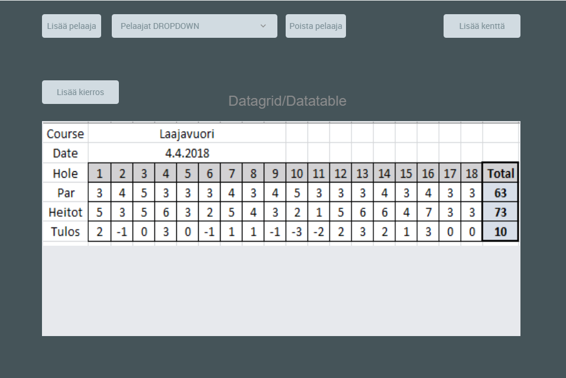

# HARJOITUSTYÖ 

### Tekijät:

- Mikko Vornanen L5571  
- Ilari Rajala L4134

## Sovelluksen yleiskuvaus

Sovelluksella olisi tarkoitus näyttää dataa tietokannasta. Tähän dataan kuuluu mm.  
Frisbeegolfkentät, Pelaajat ja kierrokset joissa jokaisen pelatun reiän tulokset.

## Kohdeyleisö

Käyttöliittymä ja tietokanta on suunnattu kaikille frisbeegolfin pelaajille.  
Mahdollisesti parantaisi käyttöliittymää tulevaisuudessa ja vaihtaisi alustaa tai
teknologiaa saaden siitä oikeasti käytännöllisen työkalun.

## Käyttöympäristö ja käytetyt teknologiat

Windows käyttöympäristö. WPF-sovellus C#:lla sekä MySQL-tietokanta. 

## Toiminnot

| ID | Ominaisuus | Kuvaus |
|:-:|:-:|:-:|
| 1 | Näytä pelaajan tulokset | Tulostaa pelaajan tulokset tauluun |  
| 2 | Valitse pelaaja | Pystyy valitsemaan tietyn pelaajan, jonka tietoihin pystyy lisäämään kierroksia tietokantaan |
| 3 | Lisää uusi pelaaja | Lisää uuden pelaajan tietokantaan |
| 4 | Lisää kenttä | Lisää uuden kentän tietokantaan |
| 5 | Lisää kenttään reiät | Lisää uuteen kentään reiät tietokantaan|
| 6 | Lisää kierros | Lisää tietylle pelaajalle ja kentälle kierros tietokantaan |
| 7 | Lisää kierrokseen tulokset | Lisää tietylle pelaajan ja kentän kierrokselle pisteet reikä kohtaisesti ja lisää ne tietokantaan|
| 8 | Poista pelaaja | Poistaa pelaajan ja poistaisi tietokannasta samalla pelaajan kaikki tulokset |

## Käsitemalli

### Prototyyppi

## Työnjako

Työstöä kontaktikerroilla yhdessä ja tarvittaessa kotona yksin

## Työaikasuunnitelma

Kesken

